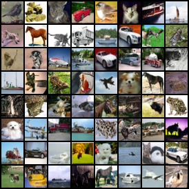

# DDPM & DDIM PyTorch
### DDPM & DDIM re-implementation with various functionality

This code is the implementation code of the papers DDPM ([Denoising Diffusion Probabilistic Models](https://arxiv.org/abs/2006.11239)) 
and DDIM ([Denoising Diffusion Implicit Models](https://arxiv.org/abs/2010.02502)).

 &nbsp; &nbsp; &nbsp;

<br><br>
 &nbsp; &nbsp; &nbsp;


---
## Objective

Our code is mainly based on [denoising-diffusion-pytorch](https://github.com/lucidrains/denoising-diffusion-pytorch)
repository, which is a Pytorch implementation of the official Tensorflow code
[Denoising Diffusion Probabilistic Models](https://github.com/hojonathanho/diffusion). But we find that there are some
differences in the implementation especially in **U-net** structure. And further we find that Pytorch implementation 
version lacks some functionality for monitoring training and does not have inference code. So we decided to
re-implement the code such that it can be helpful for someone who is first to **Diffusion** models.

---
## Results

|  Dataset  | Model checkpoint name | FID (↓) | 
|:---------:|:---------------------:|:-------:|
|  Cifar10  |   cifar10_64dim.pt    |  11.81  |
|  Cifar10  |   cifar10_128dim.pt   |  8.31   |
| CelebA-HQ |   celeba_hq_256.pt    |  11.97  |

---
## Installation
Tested for ```python 3.8.17``` with ```torch 1.12.1+cu113``` and ```torchvision 0.13.1+cu113```.
Download appropriate pytorch version via [torch website](https://pytorch.org/get-started/previous-versions/#v1121) or by following command.
```
pip install torch==1.12.1+cu113 torchvision==0.13.1+cu113 torchaudio==0.12.1 --extra-index-url https://download.pytorch.org/whl/cu113
```
Install other required moduls by following command.
```
pip install -r requirements.txt
```

---
## Quick Start
### Inference
Download pre-trained model checkpoints from [model checkpoints](https://drive.google.com/drive/folders/1YdFQEb3d7rInRVVLLN3VZu-fI0qq15pG?usp=sharing)

- Cifar10 (64 dimension for first hidden dimension)
```commandline
python inference.py -c ./config/inference/cifar10.yaml -l /path_to_cifar10_64dim.pt/cifar10_64dim.pt
```
- Cifar10 (128 dimension for first hidden dimension, purposed structure by original implementation)
```commandline
python inference.py -c ./config/inference/cifar10_128dim.yaml -l /path_to_cifar10_128dim.pt/cifar10_128dim.pt
```
- CelebA-HQ

You have to download CelebA-HQ dataset from [kaggle](https://www.kaggle.com/datasets/badasstechie/celebahq-resized-256x256/).
After un-zipping the zip file, you may find folder named ```/celeba_hq_256```, make the folder named ```/data``` if your 
project directory does not have it, place the ```/celeba_hq_256``` folder under the ```/data``` folder such that final
structure must be configured as follows.
```
- DDPM
    - /config
    - /src
    - /images_README
    - inference.py
    - train.py
    ...
    - /data (make the directory if you don't have it)
        - /celeba_hq_256
            - 00000.jpg
            - 00001.jpg
            ...
            - 29999.jpg
    
```

```commandline
python inference.py -c ./config/inference/celeba_hq_256.yaml -l /path_to_celeba_hq_256.pt/celeba_hq_256.pt
```

### Training

- Cifar10 (64 dimension for first hidden dimension)
```commandline
python train.py -c ./config/cifar10.yaml
```
- Cifar10 (128 dimension for first hidden dimension, purposed structure by original implementation)
```commandline
python train.py -c ./config/cifar10_128dim.yaml
```
- CelebA-HQ

You have to download dataset, consult details in inference section in Quick Start.

```commandline
python train.py -c ./config/celeba_hq_256.yaml
```

---
## Training

<details>
<summary>Expand for details</summary>

To train the diffusion model, first thing you have to do is to configure your training settings by making configuration
file. You can find some example inside the folder ```./config```. I will explain how to configure your training using
```./config/cifar10_example.yaml``` file and ```./config/cifar10_torch_example.yaml``` file.
Inside the ```cifar10_example.yaml``` you may find 4 primary section, ```type, unet, ddim, trainer```. 

We will first look at ```trainer``` section which is configured as follows.

```yaml
dataset: cifar10
batch_size: 128
lr: 0.0002
total_step: 600000
save_and_sample_every: 2500
num_samples: 64
fid_estimate_batch_size: 128
ddpm_fid_score_estimate_every: null
ddpm_num_fid_samples: null
tensorboard: true
clip: both
```
- ```dataset```: You can give Dataset name which is available by ```torchvision.datasets```. You can find some Datasets provided
by torchvision in this [website](https://pytorch.org/vision/stable/datasets.html). If you want to use torchvision's
Dataset just provide the dataset name, for example ```cifar10```. Currently, tested datasets are ```cifar10```. 
Or if you want to use custom datasets which you have prepared, you have to pass the path to the folder which is containing
images 


- ```batch_size, lr, total_step```: You can find the values used by DDPM author in the [DDPM paper](https://arxiv.org/abs/2006.11239)
Appendix B. total_step means total training step, for example DDPM author trained cifar10 model with 800K steps.


- ```save_and_sample_every```: The interval to which save the model and generated samples. For example in this case, 
for every 2500 steps trainer will save the model weights and also generate some sample images to visualize the training progress.


- ```num_samples```: When sampling the images evey ```save_and_sample_every``` steps, trainer will sample total ```num_samples``` 
images and save it to one large image containing each sampled images where one large image have (num_samples)**0.5 rows and
columns. So ```num_samples``` must be square number ex) 25, 36, 49, 64, ...


- ```fid_estimate_batch_size```: Batch size for sampling images for FID calculation. This batch size will be applied to
DDPM sampler as well as DDIM samplers. If you cannot decide the value, just setting this value equal to ```batch_size``` will
be fine.


- ```ddpm_fid_score_estimate_every```: Step interval for FID calculation using DDPM sampler. If set to null, FID score
will not be calculated with DDPM sampling. If you use DDPM sampling for FID calculation, i.e. setting this value other than null, 
it can be very time-consuming, ***so it is wise to set this value to null***, and use DDIM sampler for 
FID calculation (Using DDIM sampler is explained below). But anyway you can calculate FID score with DDPM sampler if you **insist**.


- ```ddpm_num_fid_samples```: Number of sampling images for FID calculation using DDPM sampler. If you set 
```ddpm_fid_score_estimate_every``` to null, i.e. not using DDPM sampler for FID calculation, then this value will
be just ignored.


- ```tensorboard```: If set to true, then you can monitor training progress such as loss, FID value, and sampled images,
during training, with the tensorboard.


- ```clip```: It must be one of [both, true, false]. This is related to sampling of x_{t-1} from p_{theta}(x_{t-1} | x_t).
There are two ways to sample x_{t-1}.
One way is to follow paper and this corresponds to line 4 in Algorithm 2 in DDPM paper. (```clip==False```)
Another way is to clip(or clamp) the predicted x_0 to -1 ~ 1 for better sampling result.
To clip the x_0 to out desired range, we cannot directly apply (11) to sample x_{t-1}, rather we have to
calculate predicted x_0 using (4) and then calculate mu in (7) using that predicted x_0. Which is exactly
same calculation except for clipping.
As you might easily expect, using clip leads to better sampling result since it
restricts sampled images range to -1 ~ 1. So for the better sampling result, it is strongly suggested 
setting ```clip``` to true. If ```clip==both``` then sampling is done twice, one done with
```clip==True``` and the other done with ```clip==False```.
[Reference](https://github.com/hojonathanho/diffusion/issues/5)

---

Now we will look at ```type, unet``` section which is configured as follows.

```yaml
# ```./config/cifar10_example.yaml```
type: original
unet:
  dim: 64
  image_size: 32
  dim_multiply:
  - 1
  - 2
  - 2
  - 2
  attn_resolutions:
  - 16
  dropout: 0.1
  num_res_blocks: 2
```

```yaml
# ```./config/cifar10_torch_example.yaml```
type: torch
unet:
  dim: 64
  image_size: 32
  dim_multiply:
  - 1
  - 2
  - 2
  - 2
  full_attn:
  - false
  - true
  - false
  - false
  attn_heads: 4
  attn_head_dim: 32
```

-```type```: It must be one of [original, torch]. ***original*** will use U-net structure which was originally suggested by
Jonathan Ho. So it's structure will be the one used in [Denoising Diffusion Probabilistic Models](https://github.com/hojonathanho/diffusion)
which is an official version written in Tensorflow. ***torch*** will use U-net structure which was suggested by 
[denoising-diffusion-pytorch](https://github.com/lucidrains/denoising-diffusion-pytorch) which is a transcribed version of
official Tensorflow version. 

I have separated those two because there structure differs significantly. To name a few, following is the difference of
those two U-net structure.
1. official version use self Attention where the feature map resolution at each U-net level 
   is in ```attn_resolutions```. In the DDPM paper you can find that they used self Attention at the 16X16 resolution, 
   and this is why ```attn_resolutions``` is by default ```[16, ]```

   On the other hand, Pytorch transcribed version use Linear Attention and multi-head self Attention. They use
   multi-head self Attention at the U-net level where ```full_attn``` is true and Linear Attention at the 
   rest of the U-net level. So in this particular case, they used multi-head self Attention at the U-net level 1 (I will 
denote U-net level as 0, 1, 2, 3, ...) and the Linear Attention at the U-net level 0, 2, 3.

-```unet.dim```: This is related to the hidden channel dimension of feature map at each U-net model. You can find more
detail right below.

-```unet.dim_multiply```: ```len(dim_multiply)``` will be the depth of U-net model with at each level i, the dimension
        of channel will be ```dim * dim_multiply[i]```. If the input image shape is [H, W, 3] then at the lowest level,
        feature map shape will be [H/(2^(len(dim_multiply)-1), W/(2^(len(dim_multiply)-1), dim*dim_multiply[-1]]
        if not considering U-net down-up path connection.

-```unet.image_size```: Size of the input image. Image will be resized and cropped if ```image_size``` does not
equal to actual input image size. Expected to be ```Integer```, I have not tested for non-square images.

-```unet.attn_resolution / unet.full_attn```: Explained above. Since ```attn_resolution``` value 
must equal to the resolution value of feature map where you want to apply self Attention, you have to carefully 
calculate desired resolution value. In the case of ```full_attn```, it is related to applying particular Attention mechanism at each
level, it must satisfy ```len(full_attn) == len(dim_multiply)```

-```unet.num_res_blocks```: Number of ResnetBlock at each level. In downward path, at each level, there will be
num_res_blocks amount of ResnetBlock module and in upward path, at each level, there will be
(num_res_blocks+1) amount of ResnetBlock module.

-```unet.attn_heads, unet.attn_head_dim```: In the torch implementation it uses multi-head-self-Attention. attn_head is 
the # of head. It corresponds to h in "Attention is all you need" paper. See section 3.2.2
attn_head_dim is the dimension of each head. It corresponds to d_k in Attention paper.

---

Lastly we will look at ```ddim``` section which is configured as follows.


```yaml
ddim:
  0:
    ddim_sampling_steps: 20
    sample_every: 5000
    calculate_fid: true
    num_fid_sample: 6000
    eta: 0
    save: true
  1:
    ddim_sampling_steps: 50
    sample_every: 50000
    calculate_fid: true
    num_fid_sample: 6000
    eta: 0
    save: true
  2:
    ddim_sampling_steps: 20
    sample_every: 100000
    calculate_fid: true
    num_fid_sample: 60000
    eta: 0
    save: true
```

There are 3 subsection (0, 1, 2) which means it will use 3 DDIM Sampler for sampling image 
and FID calculation during training. The name of each subsection, which are 0, 1, 2,
is not important. Each DDIM Sampler name will be set to ```DDIM_{index}_steps{ddim_sampling_steps}_eta{eta}``` no matter
what the name of each subsection is set in configuration file.

-```ddim_sampling_steps```: The number of de-noising steps for DDIM sampling. In DDPM they used 1000 steps for sampling images. But
in DDIM we can control the total number of de-noising steps for generating images. If this value is set to 20,
then the speed of generating image will be 50 times faster than DDPM sampling. Preferred value would be 10~100.

-```sample_every```: This control how often sampling be done with particular sampler. If set to 5000 then
every 5000 steps, this sampler will be activated for sampling images. So if total training step is 50000, there will be 
total 10 sampling action.

-```calculata_fid```: Whether to calculate FID 

-```num_fid_sample```: Only valid if ```calculate_fid``` is set to true. This control how many sampled images to use for 
FID calculation. The speed of FID calculation for particular sampler will be inversely 
proportional to (ddim_sanmpling_steps * num_fid_sample)

-```eta```: Hyperparameter to control the stochasticity, see (16) in DDIM paper.
        0: deterministic(DDIM) , 1: fully stochastic(DDPM)

-```save```: Whether to save the model checkpoint based on FID value calculated by particular sampler. If set to true
then model checkpoint will be saved on ```.pt``` file when model achieve the best
FID value for particular sampler.

---

Now we are finished setting configuration file and the training the model can be done by following command.

```commandline
python train.py -c /path_to_config_file/configuration_file.yaml 
```
[Mandatory]

    -c, --config : Path to configuration file. Path must include file name with extension .yaml

[Optional]

    -l, --load : Path to model checkpoint. Path must include file name with extension .pt
    You can resume training by using this option.
    -t, --tensorboard : Path to tensorboard folder. If you resume training and want to restore previous tensorboard, set 
    this option to previously generated tensorboard folder.
    --exp_name : Name for experiment. If not set, current time will be set as experiment name.
    --cpu_percentage : Float value from 0.0 to 1.0, default value 0.0 It is used to control the num_workers parameter for DataLoader. 
    num_workers will be set to "Number of CPU available for your device * cpu_percentage". In Windows sometimes setting 
    this value other than 0.0 yields unexpected behavior or failure to train the model. So if you have problem triaining
    the model in Windows, do not change this value.
    --no_prev_ddim_setting : If set, store true. If you have changed DDIM setting, for example change the 
    number of DDIM sampler or change the sampling steps for DDIM sampler, set this option.
</details>

---
## Inference

<details>
<summary>Expand for details</summary>

To inference the diffusion model, first thing you have to do is to configure your inference settings by making configuration
file. You can find some example inside the folder ```./config/inference```. I will explain how to configure your inference using
```./config/inference/cifar10.yaml``` file 
Inside the file you may find 4 primary section, ```type, unet, ddim, inferencer```. ```type, unet``` must match the 
configuration for the training. On the other hand, ```ddim``` section need not match to the configuration for the
training. One thing to notice is that ```sample_every, save``` option will not be used in inference for DDIM. We
are left with ```inferencer``` section.

```yaml
inferencer:
  dataset: cifar10
  batch_size: 128
  clip: true
  num_samples_per_image: 64
  num_images_to_generate: 2
  ddpm_fid_estimate: true
  ddpm_num_fid_samples: 60000
  return_all_step: true
  make_denoising_gif: true
  num_gif: 50
```

-```dataset, batch_size, clip```: Same meaning as in configuration file for training.

-```num_samples_per_image```: Same meaning as ```num_samples``` in configuration file for training.
Sampler will sample total ```num_samples_per_image``` images and save it to one large image containing each sampled images 
where one large image have (num_samples)**0.5 rows and columns. So ```num_samples_per_image``` must be square number ex) 25, 36, 49, 64, ...

-```num_images_to_generate```: How many large merged image to generate. So if this value is set to 2 then there will be
2 large image with each image containing ```num_samples_per_image``` sampled sub images.

-```ddpm_fid_estimate, ddpm_num_fid_samples```: Whether to calculate FID value for DDPM sampler. And if ```ddpm_fid_estimate```
is set to true, ```ddpm_num_fid_samples``` decides the number of sampling images for calculating FID value.

-```return_all_steps```: Whether to return all the images during de-noising steps. So in DDPM sampler, during 1000 
de-noising steps all the intermediate images will be returned. In the case of DDIM sampler, ```ddim_sampling_steps``` images
will be returned.

-```make_denoising_gif```:  Whether to make gif which contains de-noising process visually. To make denoising gif,
```return_all_steps``` must set to true.

-```num_gif```: Number of images to make gif which contains de-noising process visually. Intermediate denoised image
will be sampled evenly with ```num_gif``` images to make denoising gif.

---

Now we are finished setting configuration file and the inferencing can be done by following command.

```commandline
python inference.py -c /path_to_config_file/configuration_file.yaml -l /path_to_model_checkpoint_file/model_checkpoint.pt
```

[Mandatory]

    -c, --config : Path to configuration file. Path must include file name with extension .yaml
    -l, --load : Path to model checkpoint. Path must include file name with extension .pt
</details>

---
## References

